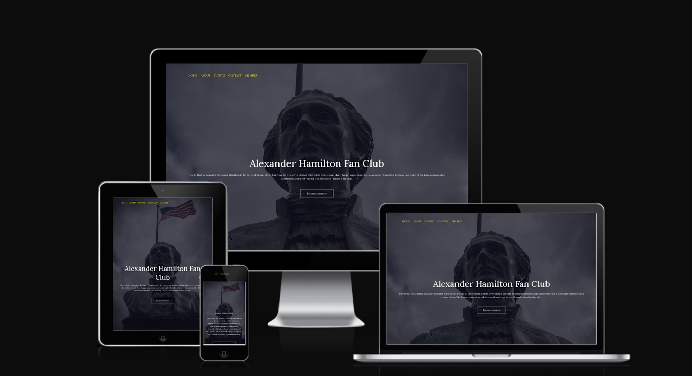
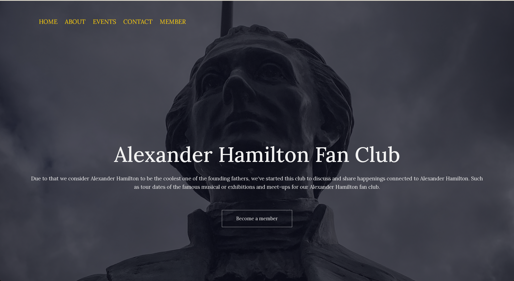
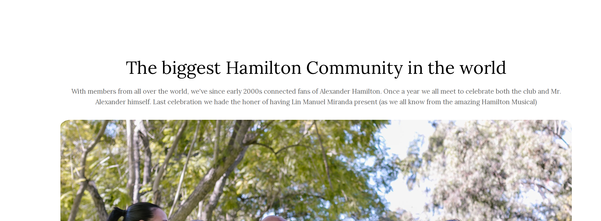
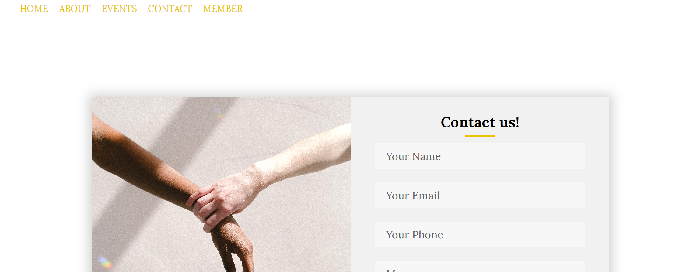
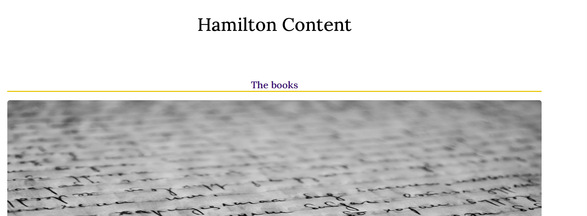
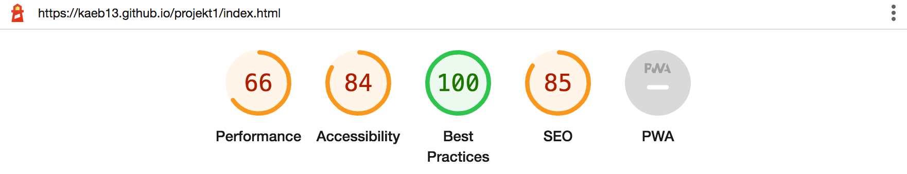

  
  <h1>Alexander Hamilton Fan Site </h1>
  
  

    An place online with the purpose to connect fans to the late Mr. Alexander Hamilton, one of the 
     founding fathers of America.  
  

  <h3> Features </h3>

  ## Navigation 

  
  

# The navigation bar is located on the write side of the website and is in a strong yellow color. It also has a hover function with a small line that appears when you hover over the categories. The navigation bar is avaible from all of the html-files.

  
  ## Header 

  

  # The header is avaible on the index home screen and is not availble on all of the htlm-pages
  # for the member, contact and event page it's only white due to extra focus on the body content on the side. 

  ## About us 

  

# This side tells us that the club is one of the biggest Alexander Hamilton in the entire world, it also tells the viewer that the club meets up and celebrate once a year. It also shows a picture of group of people that laughs together and button linked to the member page. 

## Contact and member forms 

# The same code is used for both contact and member form. I wanted the both to seem simular for the viewer and have only adjusted the text content for it's proper use. Both of these also have buttons linked to different thank you-pages. 

## Events 

# No header is visable on the events-page due to that I want the viewers focus to be on the picture with links above. The links have a hover-function that display a yellow line when hovering over. 

<h3>Testing</h3>

# Tested site in different browers, both in Safari, Chrome and Firefox. The content on the site works well with smaller screens and is responsive. It also has functionals links and is easy to understand to the viewer of site. 

<h3>Bugs</h3>

# When deployed none of site pictures was functioning on the site. Had to redo the file-paths.

<h3>Validator testing</h3>

# Passed with no issues in both the validator-testor for CSS and for HTML. 

# Lighthouse results shows that there should be improvement in code for accessibilty. 

<h3>Unfixed bugs</h3>

# no unfixed bugs. 

<h3>Deployement</h3>

# Deployement was done via Github. It was done via settings and pages section. Problem with deployement and images files but this was solved. 

# live link: https://kaeb13.github.io/projekt1/

<h3>Credit</h3>

# Thank you for the usage of the start-page code in this tutorial: https://www.youtube.com/watch?v=oYRda7UtuhA&ab_channel=EasyTutorials

# Also to the tutorial of the forms for member and contact: https://www.youtube.com/watch?v=Db5jCkrVgAw&ab_channel=TrueCoder

# other helpful links visited to finish this project:

 “https://www.w3schools.com/css/css_navbar.asp “https://www.w3schools.com/css/css_navbar.asp
https://blog.hubspot.com/website/remove-underline-from-links-css”
“https://elementor.com/blog/web-fonts/?utm_source=google&utm_medium=cpc&utm_campaign=13060922353&utm_term=&gclid=CjwKCAiA7IGcBhA8EiwAFfUDscUstEd_7Elb8Up2S3el27o8SbKREPjOB5F_dufulbXfaWgevY5eDhoCxPIQAvD_BwE”
“https://htmlcolorcodes.com/“
“https://www.tothenew.com/blog/how-to-consistently-push-footer-at-the-bottom-using-css/“
“https://www.freecodecamp.org/news/css-shapes-explained-how-to-draw-a-circle-triangle-and-more-using-pure-css/“
“https://www.folkstalk.com/tech/circle-css-with-text-in-the-center-with-code-examples/“
“https://www.w3schools.com/howto/howto_css_signup_form.asp”
“https://stackoverflow.com/questions/5969114/how-do-i-make-an-image-smaller-with-css”
“https://www.amazon.com/s?k=alexander+hamilton+books&i=stripbooks-intl-ship&crid=3AO4ALP8XKZRJ&sprefix=alexander+hamilton%2Cstripbooks-intl-ship%2C798&ref=nb_sb_noss_1”
“https://www.amazon.com/s?k=alexander+hamilton+books&i=stripbooks-intl-ship&crid=3AO4ALP8XKZRJ&sprefix=alexander+hamilton%2Cstripbooks-intl-ship%2C798&ref=nb_sb_noss_1”
“https://www.nyhistory.org/exhibitions/alexander-hamilton-panel-exhibition”
“https://codepen.io/khadkamhn/pen/ZGvPLo”
"https://sebhastian.com/css-not-linking-html/"
"https://tylerduprey-52451.medium.com/a-perfect-square-with-css-964499440998"
"https://www.google.com/search?q=contact+us+form+html+css+how+to+make+it+standing+above+each+other&oq=contact+us+form+html+css+how+to+make+it+standing+above+each+other&aqs=chrome.0.69i59.1857j0j4&sourceid=chrome&ie=UTF-8"
"https://htmlcolorcodes.com/color-picker/"
"https://coder-coder.com/how-to-fix-css-background-image-not-working/"
"https://rgbacolorpicker.com/"
"https://stackoverflow.com/questions/39031242/html-how-to-move-navbar-at-edge-left-side"
"https://htmlcolorcodes.com/"
"https://stackoverflow.com/questions/4202767/css-layout-places-text-right-next-to-it-instead-of-below"
"https://teamtreehouse.com/community/why-wont-my-textalign-center-command-respond-in-css"
"https://stackoverflow.com/questions/26867795/font-awesome-is-not-showing-icon"
"https://www.w3schools.com/css/css3_mediaqueries.asp"
"https://www.folkstalk.com/tech/font-to-be-thinner-css-with-code-examples/"
"https://www.folkstalk.com/tech/font-to-be-thinner-css-with-code-examples/"
"https://www.w3schools.com/howto/howto_css_contact_form.asp"
"https://stackoverflow.com/questions/5969114/how-do-i-make-an-image-smaller-with-css"
"https://www.w3schools.com/howto/howto_css_contact_form.asp"
"https://coder-coder.com/how-to-center-button-with-html-css/"
"https://developer.mozilla.org/en-US/docs/Web/CSS/transform"

# All of the pictures are taken from pexels.com
# All of the fonts are taken from google fonts 
# All of the icons are taken from fontawesome version 5. 

# Created by name: Ebba Kask
# Contact: kaskebba@gmail.com 

